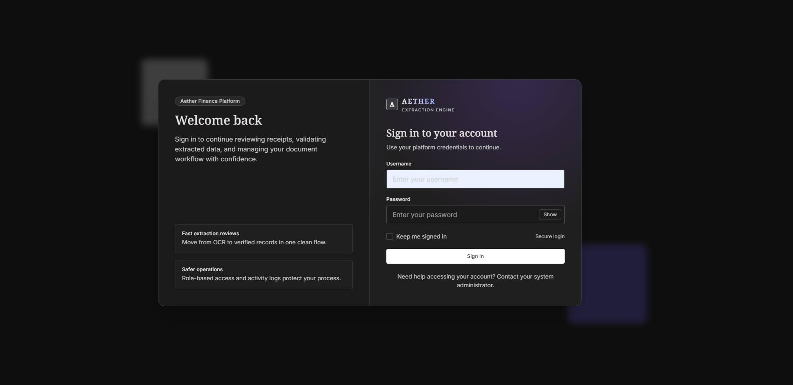
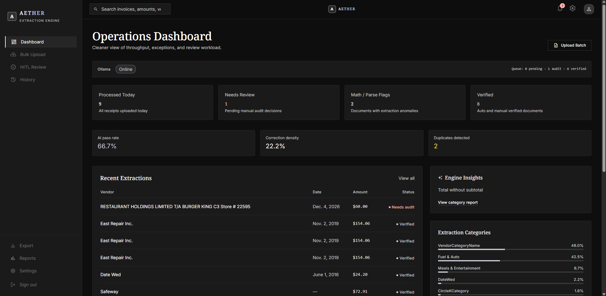
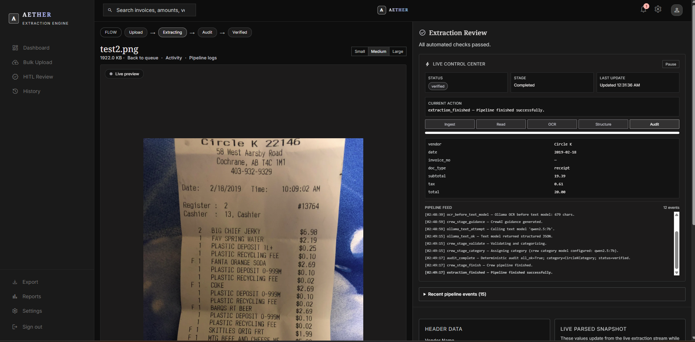

# Offline Receipt System

<p align="left">
  
</p>

AI-powered receipt/invoice extraction platform built with Django 5, DRF, SQLite, and local Ollama models.  
It combines OCR + structured parsing + deterministic math/audit checks to reduce hallucinations before records are verified.

## System Preview

### Login


### Dashboard


### Extraction Page



## Key Features

- Local-first extraction pipeline (Ollama OCR + text model parsing)
- Human-in-the-loop (HITL) review queue for exceptions
- Deterministic validation checks for totals and parse anomalies
- Audit timeline and activity trace per document
- Export verified records to CSV/Excel
- Settings UI for model endpoints and runtime behavior
- API endpoints for uploads, queue stats, health, and requeue operations

## Tech Stack

- **Backend:** Django 5, Django REST Framework
- **Database:** SQLite (default)
- **AI runtime:** Ollama + CrewAI pipeline integration
- **Document processing:** PyMuPDF (`pymupdf`)
- **Frontend:** Django templates + Tailwind classes

## Quick Start

### 1) Create environment and install dependencies

```powershell
cd "path\to\Offline Receipt System"
python -m venv .venv
.\.venv\Scripts\activate
pip install -r requirements.txt
copy .env.example .env
```

### 2) Run migrations and create admin user

```powershell
python manage.py migrate
python manage.py createsuperuser
```

### 3) Start Ollama and pull models

```powershell
ollama serve
ollama pull glm-ocr:latest
ollama pull qwen2.5:7b
```

### Recommended model setup (best for this project)

Use this pair as the default:

- **OCR model:** `glm-ocr:latest`
- **Text/parse model:** `qwen2.5:7b`

Why this combo works well:

- `glm-ocr:latest` is strong for receipt text extraction and noisy scans.
- `qwen2.5:7b` gives good structured JSON parsing quality at reasonable local speed.

### 4) Start Django app

```powershell
python manage.py runserver
```

Open `http://127.0.0.1:8000/` and sign in.

## Windows One-Click Scripts

For Windows users, you can run the project with these batch files in the project root:

- `setup.bat`  
  Creates `.venv`, installs dependencies, creates `.env` (if missing), runs migrations, and offers to create a superuser.
- `create_superuser.bat`  
  Prompts for username/email/password and creates a Django superuser.
- `run.bat`  
  Starts Django on `0.0.0.0:8000` for local/LAN access.

Typical flow:

```powershell
setup.bat
create_superuser.bat
run.bat
```

## Runtime Configuration

Use `.env` for core Django config:

| Variable | Purpose |
|---|---|
| `SECRET_KEY` | Django secret |
| `DEBUG` | `True` / `False` |
| `ALLOWED_HOSTS` | Comma-separated hosts |

Use **`/app/settings/`** (or Django admin system settings) for model runtime config:
- Ollama base URL
- OCR model name (`glm-ocr:latest` recommended)
- Text model name (`qwen2.5:7b` recommended)
- vision-first toggle

Note: runtime model settings are DB-backed; they are not read from `.env` on every request.

## Main Routes

### App pages

| Path | Purpose |
|---|---|
| `/app/` | Dashboard and KPIs |
| `/app/upload/` | Bulk upload |
| `/app/audit/` | Needs-audit queue |
| `/app/review/<id>/` | Split HITL review |
| `/app/activity/<id>/` | Audit timeline |
| `/app/history/` | History ledger |
| `/app/categories/` | Category management |
| `/app/export/` | CSV/Excel export |
| `/app/reports/` | Reporting |
| `/app/settings/` | Runtime model settings |

### API endpoints

| Path | Purpose |
|---|---|
| `/api/documents/` | Upload document (`multipart file`) |
| `/api/documents/<id>/requeue/` | Re-run extraction |
| `/api/health/ollama/` | Ollama connectivity health check |
| `/api/ollama/tags/` | List available models |
| `/api/ollama/prepare-model/` | Pull/update model by role |
| `/api/queue-stats/` | Live queue counters |
| `/api/export/?from=&to=` | CSV export |
| `/api/export.xlsx/?from=&to=` | Excel export |

## Testing

```powershell
python -m pytest documents/tests/ -v
```

## Notes

- Uploads are single multipart POSTs (no client-side chunking).
- For large files, tune:
  - `DATA_UPLOAD_MAX_MEMORY_SIZE`
  - `FILE_UPLOAD_MAX_MEMORY_SIZE`
  in `config/settings.py`.
- OCR is fully local through Ollama (no Tesseract dependency).
